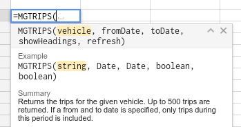

# mgsheets
A [Google App-Script library](https://developers.google.com/apps-script/) to use the [MyGeotab API](https://my.geotab.com/sdk) directly from within your Google Sheets as [custom functions](https://developers.google.com/apps-script/guides/sheets/functions).

It allows you to easily add a formula in your Google Sheet, such as

`=MGTRIPS("Company Van")`

This function will return the recent **Trips** for the vehicle named **Company Van**.

## Custom functions
Google sheets will provide you with help if you type the function name inside the cell. 
For example =MGTRIPS(
 

If you want to use this in a Google Spreadsheet - open the script editor and add all the files in the scr folder to the project. Note that you should rename the .js files to .gs.
